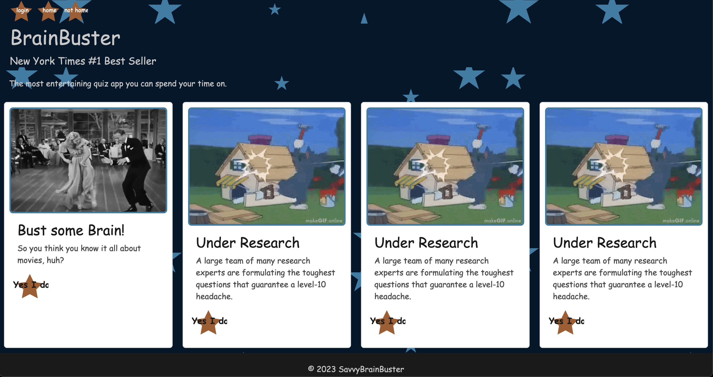

# SavvyBrainBuster [MIT license](https://opensource.org/licenses/MIT)
BrainBuster is an online trivia quiz site with a variety of topics and interests that people can test their knowledge with. We have a login portal so you can save certain topics and quizzes to better curate your trivia experience.

## Table of Contents
- [Description](#description)
- [Table of Contents](#table-of-contents)
- [Installation](#installation)
- [Usage](#usage)
- [License](#license)
- [Contributing](#contributing)
- [Tests](#tests)
- [Questions](#questions)

## Installation
Visit our website here: https://savvybrainbuster.onrender.com 
For best results, due to incompatibilities with Render, copy the code onto your local machine here: 
https://github.com/charium/SavvyBrainBuster 

## Technologies 
Technologies used on this website are 
- Express.js
- Bootstrap
- PostSQL
- Sequalize
- HTML/CSS

## Usage
To use this website, simply sign up or login then click a quiz to get started. 

## The Deployed Webpage

## License
This application falls under the MIT License. Find further details in the repository.

## Contributing
Contributing members are thanked and appreciated:
[Charium](https://github.com/Charium)
[Smpilecki](https://github.com/Smpilecki)
[Trevorapena](https://github.com/Trevorapena)
[sfonuta10](https://github.com/sfonua10)

## Tests
We are not allowing tests at this point in time. 

## Questions
If you have any questions, contact a team member by github at Charium